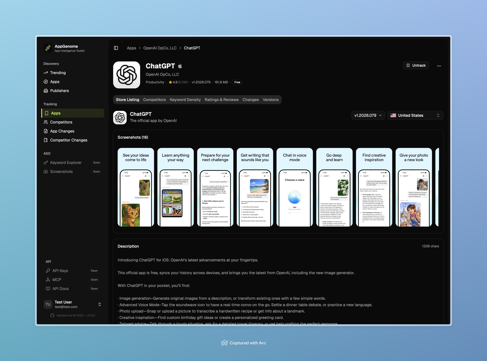
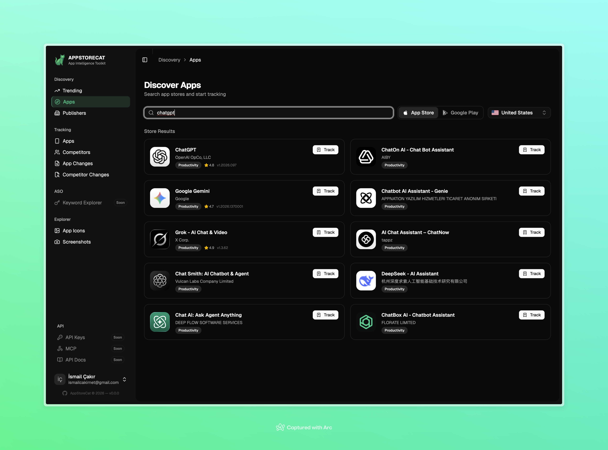
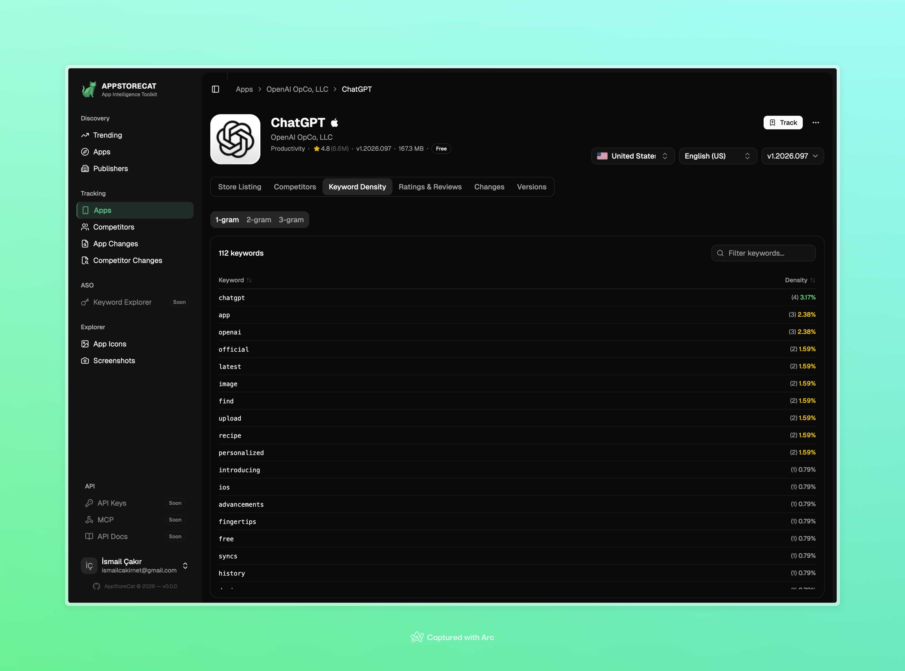
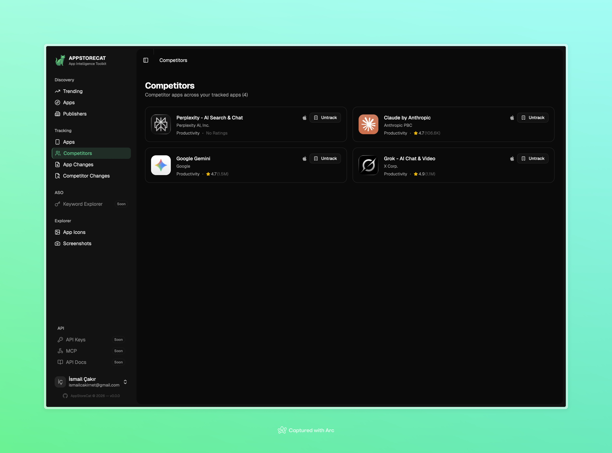

# AppStoreCat

> **Dokümantasyon:** [English](README.md) | [Türkçe](README-tr.md)

iOS ve Android için açık kaynak uygulama istihbarat araç seti. Mağaza listelemelerini takip edin, değişiklikleri izleyin, anahtar kelimeleri analiz edin ve trend uygulamaları keşfedin.



## Özellikler

### Trend Listeler
Her iki mağazada da ücretsiz, ücretli ve en çok kazanan uygulamaların günlük anlık görüntüleri ve geçmiş sıralama verileri.


### Uygulama Keşfi
App Store ve Google Play'de uygulama arayın, trend listelerden keşfedin veya tüm yayıncı kataloglarını içe aktarın.



### Mağaza Listeleri
Desteklenen her dil için başlık, açıklama, ekran görüntüleri ve meta verilerle çok dilli mağaza listesi takibi.


### Puanlar ve Yorumlar
Puan trendlerini izleyin ve ülke, puan ve tarihe göre filtreleme ile kullanıcı yorumlarını senkronize edin.


### Anahtar Kelime Yoğunluğu
ASO odaklı anahtar kelime analizi: n-gram çıkarma (1/2/3 kelime), 50 dil için durak kelime filtreleme ve uygulamalar arası karşılaştırma.



### Değişiklik Algılama
Mağaza listesi değişikliklerinin otomatik tespiti (başlık, açıklama, ekran görüntüleri, diller) ve eski/yeni değer takibi.


### Rakip Takibi
Rakip ilişkileri tanımlayın ve mağaza varlıklarını yan yana izleyin.



### Yayıncı Keşfi
Yayıncıları arayın, uygulama kataloglarını görüntüleyin ve tüm uygulamalarını toplu içe aktarın.


## Mimari

```
Frontend :7461 --> Backend API :7460 --> scraper-appstore :7462
                        |           --> scraper-gplay :7463
                        v
                    MySQL :7464
```

| Servis | Teknoloji | Açıklama |
|--------|-----------|----------|
| **backend** | Laravel 13, PHP 8.4 | API gateway, iş mantığı, veritabanı |
| **frontend** | React 19, Vite, TypeScript | Kullanıcı arayüzü |
| **scraper-appstore** | Fastify 5, Node.js | App Store verisi |
| **scraper-gplay** | FastAPI, Python | Google Play verisi |

## Hızlı Başlangıç

```bash
git clone https://github.com/ismailcaakir/appstorecat.git
cd appstorecat
make setup
make dev
```

http://localhost:7461 adresini açın ve bir hesap oluşturun.

Detaylı kurulum talimatları için [Kurulum Kılavuzu](docs/tr/getting-started/installation.md)'na bakın.

## Dokümantasyon

### Başlarken
- [Kurulum](docs/tr/getting-started/installation.md)
- [Yapılandırma](docs/tr/getting-started/configuration.md)
- [Hızlı Başlangıç](docs/tr/getting-started/quick-start.md)

### Mimari
- [Genel Bakış](docs/tr/architecture/overview.md)
- [Veri Modeli](docs/tr/architecture/data-model.md)
- [Veri Toplama](docs/tr/architecture/data-collection.md)
- [Kuyruk Sistemi](docs/tr/architecture/queue-system.md)
- [Connector'lar](docs/tr/architecture/connectors.md)
- [Senkronizasyon Pipeline](docs/tr/architecture/sync-pipeline.md)

### Özellikler
- [Trend Listeler](docs/tr/features/trending-charts.md)
- [Uygulama Keşfi](docs/tr/features/app-discovery.md)
- [Mağaza Listeleri](docs/tr/features/store-listings.md)
- [Puanlar ve Yorumlar](docs/tr/features/ratings-reviews.md)
- [Anahtar Kelime Yoğunluğu](docs/tr/features/keyword-density.md)
- [Rakip Takibi](docs/tr/features/competitor-tracking.md)
- [Değişiklik Algılama](docs/tr/features/change-detection.md)
- [Yayıncı Keşfi](docs/tr/features/publisher-discovery.md)
- [Medya ve Gezgin](docs/tr/features/media-proxy.md)

### Servisler
- [Backend](docs/tr/services/backend.md)
- [Frontend](docs/tr/services/frontend.md)
- [App Store Scraper](docs/tr/services/scraper-appstore.md)
- [Google Play Scraper](docs/tr/services/scraper-gplay.md)

### API
- [Endpoint'ler](docs/tr/api/endpoints.md)
- [Kimlik Doğrulama](docs/tr/api/authentication.md)
- [Scraper API'leri](docs/tr/api/scraper-apis.md)

### Dağıtım
- [Docker](docs/tr/deployment/docker.md)
- [Production](docs/tr/deployment/production.md)
- [Sorun Giderme](docs/tr/deployment/troubleshooting.md)

### Referans
- [Ortam Değişkenleri](docs/tr/reference/environment-variables.md)
- [Makefile Komutları](docs/tr/reference/makefile-commands.md)
- [App Store Ülkeleri](docs/tr/reference/app-store-countries.md)

## Katkıda Bulunma

Kurallar için [CONTRIBUTING.md](CONTRIBUTING.md) dosyasına bakın.

## Güvenlik

Güvenlik açıkları için [SECURITY.md](SECURITY.md) dosyasına bakın.

## Lisans

[MIT](LICENSE)
