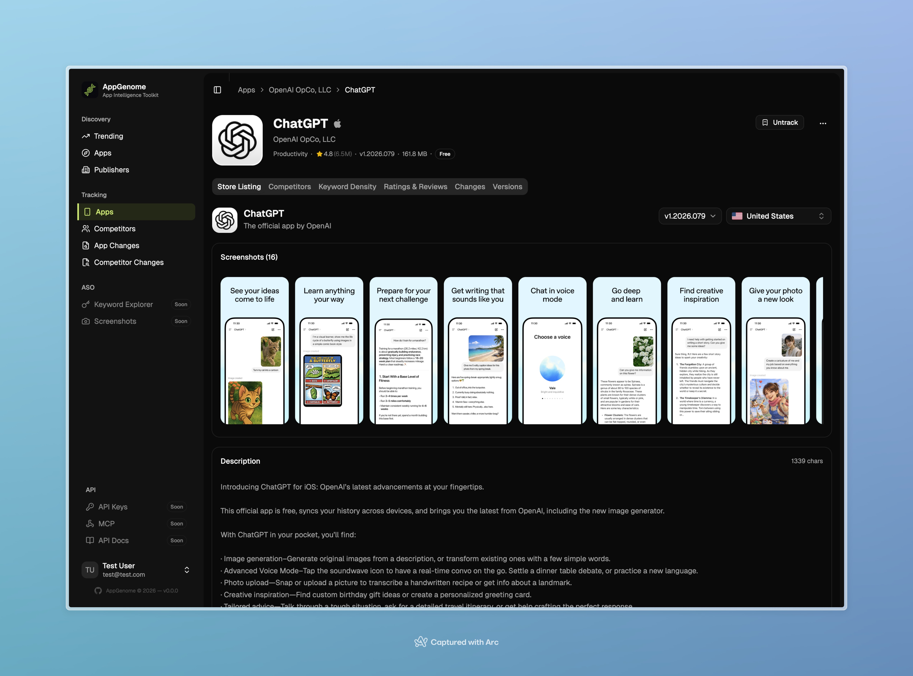

# Ratings

Track app ratings as daily per-country snapshots.

## Overview

On every sync cycle, AppStoreCat records aggregate rating metrics (average rating, rating count, star distribution) per country.

## Rating Metrics

Daily snapshots of app ratings are stored in the `app_metrics` table, with a separate record for each `(app_id, country_code, date)` tuple:

| Metric | Description |
|--------|-------------|
| **Rating** | Average rating (decimal, e.g. 4.56) |
| **Rating Count** | Total rating count |
| **Rating Breakdown** | Per-star distribution `{1: 100, 2: 50, 3: 200, 4: 500, 5: 1200}` (`rating_breakdown` JSON) |

`app_metrics.country_code` is a `CHAR(2)` and references the `countries.code` FK. For Android metrics, the `zz` "Global" ISO sentinel is used because the store returns global data; the `/countries` endpoint filters that sentinel out of its responses.

The `is_available` flag on each record reflects whether the app is reachable in that country on that day; `apps.is_available` means "reachable in at least one store".

> Schema note: the legacy `rating_delta`, `price`, `currency`, `installs_range`, and `file_size_bytes` columns were dropped from `app_metrics` (they were written but never read). Pricing now lives on the listing/identity surface, and `file_size_bytes` is sourced from `app_versions` — the authoritative writer — and surfaced via `AppDetailResource`.

## 30-Day Rating Deltas

The `RatingSummaryResource` exposes a `trend` block with `rating_delta_30d` and `rating_count_delta_30d`. These are **not** stored columns — they are computed live in PHP by diffing the latest `AppMetric` against the closest baseline record (~30 days back) for the same `(app_id, country_code)`. If either side is missing, both deltas are returned as `null`.

## UI

The **Overview** / **Metrics** view on the app detail page shows a rating summary, the star distribution chart, and the rating-count trend over time.

## Technical Details

- **Model:** `AppMetric`
- **Table:** `app_metrics` (ROW_FORMAT=COMPRESSED)
- **Unique constraint:** `(app_id, country_code, date)`
- **Sync step:** `AppSyncer::syncMetrics()` (metrics phase)
- **Delta computation:** `RatingSummaryResource::getResourceData()` — compares `latest` vs. `baseline` `AppMetric` instances at request time
